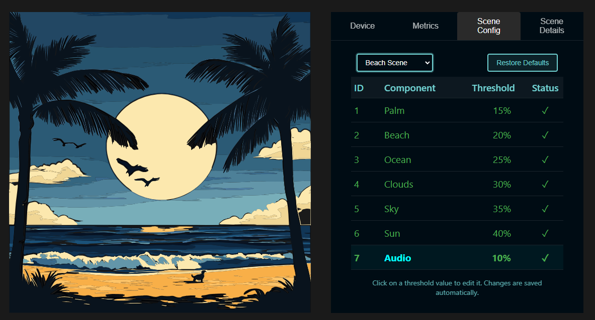

# Threshold Views



*Interactive visualization of neural feedback through immersive scenes*

An interactive meditation and relaxation application that creates immersive environments responding to your brain activity using the Neurosity device. Built upon the [Notion React Starter](https://github.com/neurosity/notion-react-starter) template, this project has evolved into a full-featured visualization tool for neural feedback.

## 🌟 Features

- 🧠 Neural Feedback - Real-time response to brain activity using Neurosity SDK
- 🎯 Customizable Thresholds - Fine-tune sensitivity for different scene elements
- 🔊 Ambient Audio - Immersive soundscapes for each environment
- 🎨 Multiple Visualization Modes - Choose between different scenes based on your mood

## 🚀 Getting Started

### Prerequisites

- [Node.js](https://nodejs.org/) (version 14 or higher)
- A [Neurosity](https://neurosity.co) device
- npm or yarn package manager

### Installation

1. Clone the repository:
```bash
git clone https://github.com/biomycobit/threshold-views.git
cd threshold-views
```

2. Install dependencies:
```bash
npm install
```

3. Start the development server:
```bash
npm start
```

4. Open [http://localhost:3000](http://localhost:3000) in your browser

## 🔧 Configuration

The application requires a Neurosity device connection. You'll need to:
1. Power on your Neurosity device
2. Connect to your device's WiFi network
3. Log in with your Neurosity credentials in the app
4. Adjust visualization thresholds in the configuration panel to match your preferences

## 🏗️ Built With

- [React](https://reactjs.org/) - Frontend framework
- [@neurosity/sdk](https://www.npmjs.com/package/@neurosity/sdk) - Brain-computer interface SDK
- [React Router](https://reactrouter.com/) - Navigation and routing
- [use-sound](https://www.npmjs.com/package/use-sound) - Audio management
- [js-yaml](https://www.npmjs.com/package/js-yaml) - YAML configuration support

## 📖 Usage

1. Connect your Neurosity device
2. Select a scene (Beach or Mountain)
3. Adjust thresholds for different elements using the configuration panel
4. Relax and observe as the scene responds to your brain activity
5. Toggle audio and visual elements as desired

Each scene has unique threshold settings that control how different elements respond to your neural activity. For example:
- Beach scene: Control waves, palm trees, and sky elements
- Mountain scene: Adjust trees, birds, and atmospheric effects

## 🤝 Contributing

Contributions are welcome! Please feel free to submit a Pull Request.

1. Fork the project
2. Create your feature branch (`git checkout -b feature/AmazingFeature`)
3. Commit your changes (`git commit -m 'Add some AmazingFeature'`)
4. Push to the branch (`git push origin feature/AmazingFeature`)
5. Open a Pull Request

## 📝 License

This project is licensed under the MIT License - see the [LICENSE](LICENSE) file for details.

## 🙏 Acknowledgments

- [Neurosity](https://neurosity.co) for their amazing BCI technology
- [Notion React Starter](https://github.com/neurosity/notion-react-starter) for the initial template
- The open-source community for their invaluable tools and libraries

## 📫 Contact

If you have any questions or feedback, please open an issue in the GitHub repository.

---
Made with ❤️ for the brain-computer interface community
